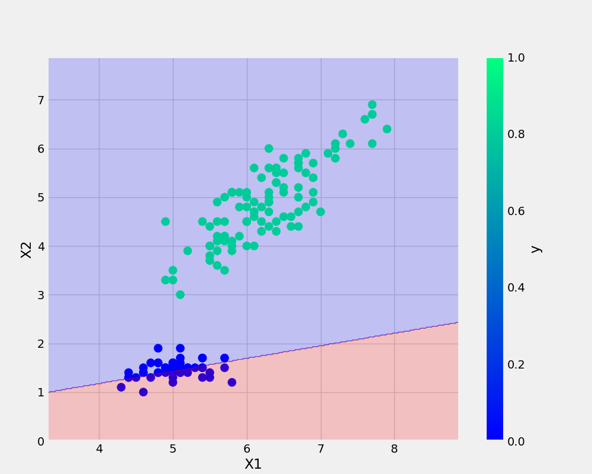

#Readme just tells you a detail about your project. Like what it is. This is why the below examples are things you can add into #readme

# AK_Repo
Perceptron_ANN


'''bash
 git add . && git commit -m "Docstring" && git push origin main
 '''

 ##Add URL
 [Git Handbook](https://github.com/midofemi/AK_Repo)

 #Add Image
 

 #To see the plot and link we just added above. Right click on README.md and preview


 #Read me template can also be generated via this website
  [Git Handbook](https://readme.so/)


#To add a python code on readme
```python
def _create_base_plot(df):
    logging.info("Creating the base plot")
    df.plot(kind="scatter", x="x1", y="x2", c="y", s=100, cmap="winter")
    plt.axhline(y=0, color="black", linestyle="--", linewidth=1)
    plt.axvline(x=0, color="black", linestyle="--", linewidth=1)
    figure = plt.gcf() # get current figure
    figure.set_size_inches(10, 8)
```
#symbol just adjust the font. The more hash, the bigger the text
## Dataset
x1 | x2 | y
-|-|-
0|0|0
0|1|0
1|0|0
1|1|1

